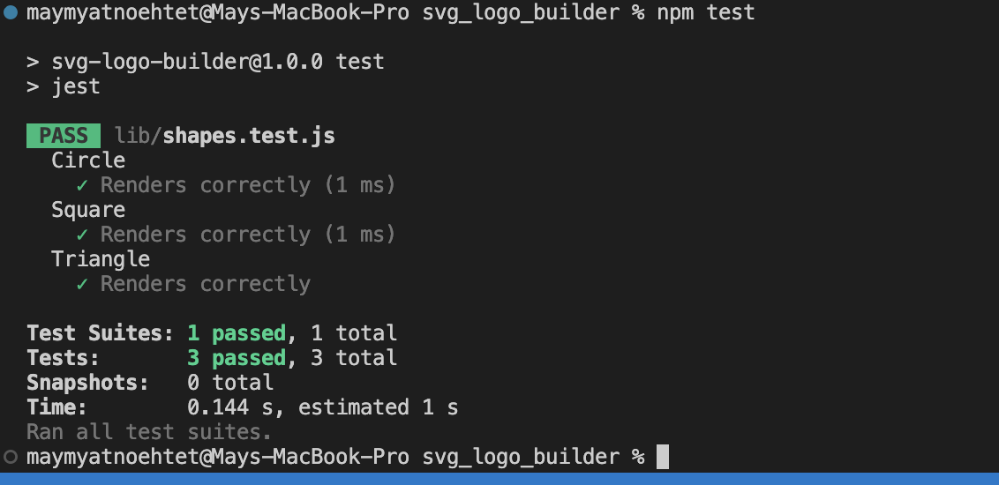

# Logo Builder
To build a Node.js command-line application that takes in user input to generate a logo and save it as an SVG file links to an external site. The application prompts the user to select a colour and shape, provide text for the logo, and save the generated SVG to a .svg file.

Repo Link: https://github.com/maymyatnoehtet/svg_logo_builder

# Installation

- Clone this repository link: git@github.com:maymyatnoehtet/svg_logo_builder.git
- Install the following:
     - Node.js Version 16.20.0
     - Jest Version 29.5.0
     - Inquirer.js: Version 6.3.1
- Open the cloned repository in the code editor.
- Open the integrated terminal and install node, jest and inquirer to ensure the code operate.

# User Story

```
AS a freelance web developer
I WANT to generate a simple logo for my projects
SO THAT I don't have to pay a graphic designer
```

# Acceptance Criteria

```
GIVEN a command-line application that accepts user input
WHEN I am prompted for text
THEN I can enter up to three characters
WHEN I am prompted for the text color
THEN I can enter a color keyword (OR a hexadecimal number)
WHEN I am prompted for a shape
THEN I am presented with a list of shapes to choose from: circle, triangle, and square
WHEN I am prompted for the shape's color
THEN I can enter a color keyword (OR a hexadecimal number)
WHEN I have entered input for all the prompts
THEN an SVG file is created named `logo.svg`
AND the output text "Generated logo.svg" is printed in the command line
WHEN I open the `logo.svg` file in a browser
THEN I am shown a 300x200 pixel image that matches the criteria I entered
```

# Test

```
const Circle = require("./shapes")
/* from Challenge 10 Requirements page */
// Circle Shape
describe('Circle', () => {
    test('Renders correctly', () => {
      const shape = new Circle();
      var color =('blue')
      shape.setColor(color);
      expect(shape.render()).toEqual(`<circle cx="50%" cy="50%" r="100" height="100%" width="100%" fill="${color}" />`);
    });
  });
``` 


